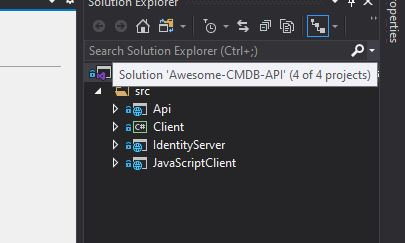

# Awesome-CMDB-API

This tool is part fo Awesome CMDB and is responsible for running Identity server, the react front end and the API used for the front end


## Getting Started

The projects included in this solution can be run in docker, but for debugging it is recomended to use the latest version of [Visual Studio](https://visualstudio.microsoft.com/)

### Prerequisites

You will need at least v3.1 of the ASP.NET Core SDK

```
Some development IDE, e.g. Visual Studio
```

## Projects
This solution contains the following projects


* **Api** This contains the REST API used by the [React UI](https://github.com/SleepyFoxStudio/Awesome-CMDB-UI). 
* **IdentityServer** Hosts IdentityServer which handles all the authntication.
* **Client** An example .net client calling the API authinticating with the IdentityServer. 
* **JavaScriptClient** An example JavaScript client calling the API authinticating with the IdentityServer. 


## Running the project locally

* Run the project in either release or debug
* All dependencies are stored in Nuget
* select which projects to run by following these steps
  * Right click on **properties** of the solution **Awesome-CMDB-API**



  * Select the projects you want to run (details of each project above)


### Coding styles

Coding guidelines, are default Resharper recommendations.

## Deployment

* Commit to GIT, latest version in master branch is used on each build


## Contributing

Please follow normal Git branching strategy, with a new branch for each feature

## Versioning

no tagging strategy defined

## Authors

* **Mark Richardson** - *Initial work* - [LinkedIn](https://www.linkedin.com/in/mark-richardson-b47b4523/)


## License

This project is open source.

## Acknowledgments

* Stack exchange